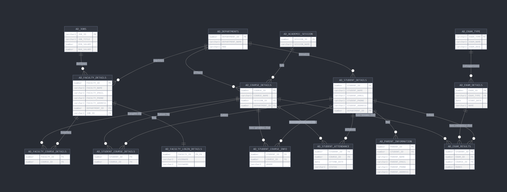

# AD (Academic) Schema Documentation

This document provides comprehensive documentation for the Academic Database (AD) schema found in  [Oracle Live SQL](https://livesql.oracle.com/). The AD schema models an educational institution's database system, including students, faculty, courses, departments, and related academic processes.

## Schema Overview

The AD schema consists of 15 tables that model the following key entities:

- Academic sessions
- Departments
- Courses
- Faculty members
- Students and their parents
- Course enrollments and grades
- Attendance records
- Exams and results

## Table Descriptions

### AD_ACADEMIC_SESSION
Represents academic periods or terms.

| Column | Data Type | Description | Constraints |
|--------|-----------|-------------|------------|
| SESSION_ID | NUMBER | Unique identifier for the academic session | Primary Key, NOT NULL |
| SESSION_NAME | VARCHAR2(50) | Name of the academic session (e.g., "2023-2024") | |

### AD_COURSE_DETAILS
Contains information about courses offered.

| Column | Data Type | Description | Constraints |
|--------|-----------|-------------|------------|
| COURSE_ID | NUMBER | Unique identifier for the course | Primary Key, NOT NULL |
| COURSE_NAME | VARCHAR2(50) | Name of the course | |
| SESSION_ID | NUMBER | Academic session the course is offered in | Foreign Key to AD_ACADEMIC_SESSION |
| DEPARTMENT_ID | NUMBER | Department offering the course | Foreign Key to AD_DEPARTMENTS |

### AD_DEPARTMENTS
Stores department information.

| Column | Data Type | Description | Constraints |
|--------|-----------|-------------|------------|
| DEPARTMENT_ID | NUMBER | Unique identifier for the department | Primary Key, NOT NULL |
| DEPARTMENT_NAME | VARCHAR2(50) | Name of the department | |
| HOD | VARCHAR2(50) | Head of Department | |

### AD_EXAM_DETAILS
Contains information about scheduled exams.

| Column | Data Type | Description | Constraints |
|--------|-----------|-------------|------------|
| EXAM_ID | NUMBER | Unique identifier for the exam | Primary Key, NOT NULL |
| EXAM_TYPE | VARCHAR2(50) | Type of exam | Foreign Key to AD_EXAM_TYPE, NOT NULL |
| START_DATE | DATE | Date when the exam is scheduled | |
| NAME | VARCHAR2(50) | Name of the exam | |

### AD_EXAM_RESULTS
Stores student exam results.

| Column | Data Type | Description | Constraints |
|--------|-----------|-------------|------------|
| STUDENT_ID | NUMBER | Student who took the exam | Foreign Key to AD_STUDENT_DETAILS |
| EXAM_ID | NUMBER | Exam that was taken | Foreign Key to AD_EXAM_DETAILS |
| COURSE_ID | NUMBER | Course the exam is for | Foreign Key to AD_COURSE_DETAILS |
| MARKS | NUMBER | Marks obtained by the student | |

### AD_EXAM_TYPE
Defines different types of exams.

| Column | Data Type | Description | Constraints |
|--------|-----------|-------------|------------|
| EXAM_TYPE | VARCHAR2(50) | Code for the exam type | Primary Key, NOT NULL |
| EXAM_NAME | VARCHAR2(50) | Name of the exam type | |
| EXAM_DESC | VARCHAR2(50) | Description of the exam type | |

### AD_FACULTY_COURSE_DETAILS
Junction table linking faculty members to the courses they teach.

| Column | Data Type | Description | Constraints |
|--------|-----------|-------------|------------|
| FACULTY_ID | NUMBER | Faculty teaching the course | Foreign Key to AD_FACULTY_DETAILS |
| COURSE_ID | NUMBER | Course being taught | Foreign Key to AD_COURSE_DETAILS |

### AD_FACULTY_DETAILS
Stores information about faculty members.

| Column | Data Type | Description | Constraints |
|--------|-----------|-------------|------------|
| FACULTY_ID | NUMBER | Unique identifier for the faculty member | Primary Key, NOT NULL |
| FACULTY_NAME | VARCHAR2(50) | Name of the faculty member | |
| FACULTY_EMAIL | VARCHAR2(50) | Email address of the faculty member | |
| FACULTY_PHONE | VARCHAR2(50) | Phone number of the faculty member | |
| FACULTY_ADDRESS | VARCHAR2(100) | Address of the faculty member | |
| DEPARTMENT_ID | NUMBER | Department the faculty belongs to | Foreign Key to AD_DEPARTMENTS |
| JOB_ID | VARCHAR2(50) | Job role of the faculty member | Foreign Key to AD_JOBS |

### AD_FACULTY_LOGIN_DETAILS
Stores login credentials for faculty members.

| Column | Data Type | Description | Constraints |
|--------|-----------|-------------|------------|
| FACULTY_ID | NUMBER | Faculty member's ID | Primary Key, Foreign Key to AD_FACULTY_DETAILS, NOT NULL |
| USERNAME | VARCHAR2(50) | Login username | |
| PASSWORD | VARCHAR2(50) | Login password | |

### AD_JOBS
Defines job roles for faculty members.

| Column | Data Type | Description | Constraints |
|--------|-----------|-------------|------------|
| JOB_ID | VARCHAR2(50) | Unique identifier for the job role | Primary Key, NOT NULL |
| JOB_TITLE | VARCHAR2(50) | Title of the job role | |
| MIN_SALARY | NUMBER | Minimum salary for the role | |
| MAX_SALARY | NUMBER | Maximum salary for the role | |

### AD_PARENT_INFORMATION
Stores information about students' parents.

| Column | Data Type | Description | Constraints |
|--------|-----------|-------------|------------|
| PARENT_ID | NUMBER | Unique identifier for the parent | Primary Key, NOT NULL |
| STUDENT_ID | NUMBER | Student associated with the parent | Foreign Key to AD_STUDENT_DETAILS |
| PARENT_NAME | VARCHAR2(50) | Name of the parent | |
| PARENT_EMAIL | VARCHAR2(50) | Email address of the parent | |
| PARENT_PHONE | VARCHAR2(50) | Phone number of the parent | |
| PARENT_ADDRESS | VARCHAR2(100) | Address of the parent | |

### AD_STUDENT_ATTENDANCE
Records student attendance for courses.

| Column | Data Type | Description | Constraints |
|--------|-----------|-------------|------------|
| STUDENT_ID | NUMBER | Student whose attendance is recorded | Foreign Key to AD_STUDENT_DETAILS |
| COURSE_ID | NUMBER | Course for which attendance is recorded | Foreign Key to AD_COURSE_DETAILS |
| ATTEND_DATE | DATE | Date of the attendance record | |
| STATUS | VARCHAR2(10) | Attendance status (e.g., "Present", "Absent") | |

### AD_STUDENT_COURSE_DETAILS
Junction table linking students to courses they are enrolled in.

| Column | Data Type | Description | Constraints |
|--------|-----------|-------------|------------|
| STUDENT_ID | NUMBER | Student enrolled in the course | Foreign Key to AD_STUDENT_DETAILS |
| COURSE_ID | NUMBER | Course the student is enrolled in | Foreign Key to AD_COURSE_DETAILS |

### AD_STUDENT_COURSE_INFO
Stores grades for students in courses.

| Column | Data Type | Description | Constraints |
|--------|-----------|-------------|------------|
| STUDENT_ID | NUMBER | Student receiving the grade | Foreign Key to AD_STUDENT_DETAILS |
| COURSE_ID | NUMBER | Course the grade is for | Foreign Key to AD_COURSE_DETAILS |
| GRADE | VARCHAR2(2) | Grade received by the student | |

### AD_STUDENT_DETAILS
Stores information about students.

| Column | Data Type | Description | Constraints |
|--------|-----------|-------------|------------|
| STUDENT_ID | NUMBER | Unique identifier for the student | Primary Key, NOT NULL |
| STUDENT_NAME | VARCHAR2(50) | Name of the student | |
| STUDENT_EMAIL | VARCHAR2(50) | Email address of the student | |
| STUDENT_PHONE | VARCHAR2(50) | Phone number of the student | |
| STUDENT_ADDRESS | VARCHAR2(100) | Address of the student | |
| DEPARTMENT_ID | NUMBER | Department the student belongs to | Foreign Key to AD_DEPARTMENTS |

## Relationships

The AD schema models the following relationships:

1. **Academic Sessions and Courses:**
   - One academic session can have many courses
   - Each course belongs to one academic session

2. **Departments and Courses:**
   - One department can offer many courses
   - Each course is offered by one department

3. **Departments and Faculty:**
   - One department can employ many faculty members
   - Each faculty member belongs to one department

4. **Departments and Students:**
   - One department can enroll many students
   - Each student belongs to one department

5. **Jobs and Faculty:**
   - One job role can be assigned to many faculty members
   - Each faculty member has one job role

6. **Faculty and Login Details:**
   - One faculty member has one set of login details
   - Each set of login details belongs to one faculty member

7. **Faculty and Courses:**
   - One faculty member can teach many courses
   - One course can be taught by many faculty members

8. **Students and Parents:**
   - One student can have many parents/guardians
   - Each parent record is associated with one student

9. **Students and Courses:**
   - One student can enroll in many courses
   - One course can have many students enrolled

10. **Students and Attendance:**
    - One student can have many attendance records
    - Each attendance record is for one student and one course

11. **Students and Exam Results:**
    - One student can have many exam results
    - Each exam result is for one student, one exam, and one course

12. **Exam Types and Exams:**
    - One exam type can categorize many exams
    - Each exam belongs to one exam type

## Sample Queries

Here are some example queries demonstrating how to use the AD schema:

### 1. Find all courses offered by a specific department

```sql
SELECT c.COURSE_ID, c.COURSE_NAME, s.SESSION_NAME
FROM AD_COURSE_DETAILS c
JOIN AD_ACADEMIC_SESSION s ON c.SESSION_ID = s.SESSION_ID
WHERE c.DEPARTMENT_ID = 1; -- Replace with actual department ID
```

### 2. Find all faculty members in a specific department

```sql
SELECT f.FACULTY_ID, f.FACULTY_NAME, j.JOB_TITLE
FROM AD_FACULTY_DETAILS f
JOIN AD_JOBS j ON f.JOB_ID = j.JOB_ID
WHERE f.DEPARTMENT_ID = 1; -- Replace with actual department ID
```

### 3. Get a student's grades for all courses

```sql
SELECT c.COURSE_NAME, sci.GRADE
FROM AD_STUDENT_COURSE_INFO sci
JOIN AD_COURSE_DETAILS c ON sci.COURSE_ID = c.COURSE_ID
WHERE sci.STUDENT_ID = 1; -- Replace with actual student ID
```

### 4. Check attendance for a student in a specific course

```sql
SELECT sa.ATTEND_DATE, sa.STATUS
FROM AD_STUDENT_ATTENDANCE sa
WHERE sa.STUDENT_ID = 1 -- Replace with actual student ID
AND sa.COURSE_ID = 1;   -- Replace with actual course ID
```

### 5. Get exam results for a student

```sql
SELECT c.COURSE_NAME, e.NAME AS EXAM_NAME, er.MARKS
FROM AD_EXAM_RESULTS er
JOIN AD_COURSE_DETAILS c ON er.COURSE_ID = c.COURSE_ID
JOIN AD_EXAM_DETAILS e ON er.EXAM_ID = e.EXAM_ID
WHERE er.STUDENT_ID = 1; -- Replace with actual student ID
```

## Using the AD Schema for Training

The AD schema is well-suited for teaching SQL concepts because:

1. It models a real-world educational institution with familiar entities and relationships
2. It includes various relationship types (one-to-one, one-to-many, many-to-many)
3. It provides opportunities to demonstrate joins, aggregations, and complex queries
4. It can be used to teach data integrity through its various constraints

This schema can be used to teach:
- Basic SELECT, INSERT, UPDATE, DELETE operations
- Table joins (INNER, LEFT, RIGHT, FULL)
- Aggregation functions (COUNT, SUM, AVG, MAX, MIN)
- Grouping and filtering (GROUP BY, HAVING)
- Subqueries and common table expressions
- Views and indexes
- Transaction management

## Schema Diagram

The AD Schema ER Diagram entity-relationship diagram visualizing the AD schema structure is below. This diagram helps to understand the relationships between the tables in the schema.

