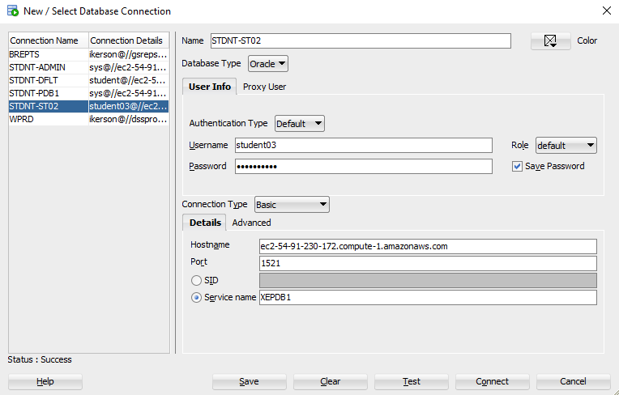

# Oracle SQL Training: Intermediate to Advanced Reporting

This training is intended for users of Oracle SQL Developer who query databases for analytical reporting. The lessons are taken from focus [Oracle SQL by Example 4th Edition](https://www.oreilly.com/library/view/oracle-sql-by/9780137047345/) and focus on on writing efficient, professional-grade SQL for multi-table reporting and advanced data manipulation. 

## Table of Contents

- [Setup Instructions](#setup-instructions)
- [Warm-Up: Single-Table Operations Review](#warm-up-single-table-operations-review)
- [Aggregate Queries and GROUP BY Logic](#aggregate-queries-and-group-by-logic)
- [Joins](#joins)
- [Subqueries](#subqueries)
- [Single-Row Built-In Functions](#single-row-built-in-functions)
- [Date and Time Logic](#date-and-time-logic)
- [Set Operators](#set-operators)
- [Analytical Functions & CTEs](#analytical-functions--ctes)

## Setup Instructions

### Install Oracle SQL Developer

* Download and install the latest version of [Oracle SQL Developer](https://www.oracle.com/tools/downloads/sqldev-downloads.html).

### Create a New Database Connection

Follow these steps to connect to the Oracle database:

1. Open **SQL Developer**

2. Navigate to **Tools** → **Connections**

3. Click **+** or **New Connection**

4. Enter the following details:

   | Field            | Value                                       |
   | ---------------- | ------------------------------------------- |
   | **Name**         | `STDNT-ST02` (or any name you prefer)       |
   | **Username**     | `student03`                                 |
   | **Password**     | *your password* (✔ Save Password)           |
   | **Role**         | `default`                                   |
   | **Hostname**     | `ec2-54-91-230-172.compute-1.amazonaws.com` |
   | **Port**         | `1521`                                      |
   | **Service name** | `XEPDB1`                                    |

5. Click **Test** to confirm the connection (Status should show: `Success`)

6. Click **Save** to store the connection

📷 *Example setup:*



### View Available Tables in the Schema

Use this query to list all non-deleted tables and their column comments in the `STUDENT` schema:

```sql
SELECT * 
FROM all_col_comments 
WHERE owner = 'STUDENT' 
  AND table_name NOT LIKE 'BIN%';
```

## Warm-Up: Single-Table Operations Review

**Goal**: Refresh SELECT basics using one real-world table (`COURSE` or `STUDENT`)

* SELECT specific and all columns
* Filtering with `WHERE`, `BETWEEN`, `IN`, `LIKE`, `IS NULL`
* Sorting with `ORDER BY`
* Column aliasing
* Using arithmetic in SELECT
* Applying built-in functions (`UPPER`, `ROUND`, `NVL`, etc.)
* Reference: Chapters 2–3, pp. 49–101

## Aggregate Queries and GROUP BY Logic

* **Lab 6.1**: Aggregates – `SUM`, `COUNT`, `AVG`, `MIN`, `MAX`, `COUNT(DISTINCT)`
* **Lab 6.2**: Grouping & Filtering – `GROUP BY`, `HAVING`, `GROUPING SETS`, `ROLLUP`, `CUBE`
* Reference: Chapter 6, pp. 263–283

## Joins

* **Lab 7.1–7.2**:

  * Equijoins, inner joins
  * OUTER JOINs (LEFT, RIGHT, FULL)
  * Cross joins and Cartesian products
  * ANSI vs Oracle `(+)` syntax
  * Multicolumn joins and self-joins
* Reference: Chapter 7 & 10, pp. 285–427

## Subqueries

* **Lab 8.1–8.4**:

  * Scalar, multicolumn, and nested subqueries
  * Correlated subqueries and EXISTS/NOT EXISTS
  * Scalar subquery expressions in `SELECT`, `ORDER BY`, `CASE`
  * ANY, ALL, and performance notes
* Reference: Chapter 8, pp. 323–376

## Single-Row Built-In Functions

* **Character Functions**: `UPPER`, `LOWER`, `INITCAP`, `SUBSTR`, `INSTR`, `TRIM`, `LPAD`
* **Number Functions**: `ROUND`, `TRUNC`, `MOD`, `FLOOR`, `CEIL`
* **Conversion Functions**: `TO_CHAR`, `TO_DATE`, `CAST`, `TO_NUMBER`
* **Null Handling**: `NVL`, `NVL2`, `COALESCE`, `NULLIF`, `LNNVL`
* **Conditional Logic**: `DECODE`, `CASE`
* Reference: Chapter 4, pp. 133–187

## Date and Time Logic

* **Working with DATE**:

  * `SYSDATE`, `CURRENT_DATE`, `SYSTIMESTAMP`, `TRUNC(date)`
  * `ROUND(date)`, `EXTRACT`, intervals
  * Implicit vs explicit conversion
  * Time zones, format masks, `TO_DATE`, `TO_CHAR`
* Reference: Chapter 5, pp. 189–261

## Set Operators

* **UNION vs UNION ALL**
* **INTERSECT**, **MINUS**
* Sort order, data types, NULL handling
* When to use vs joins/subqueries
* Reference: Chapter 9, pp. 377–397

## Analytical Functions & CTEs

* **Window Functions**:

  * `ROW_NUMBER`, `RANK`, `DENSE_RANK`, `NTILE`
  * `LAG`, `LEAD`, `FIRST_VALUE`, `LAST_VALUE`
  * `PARTITION BY`, `ORDER BY`, `ROWS BETWEEN`

* **WITH Clause / CTEs**:

  * Modular query design
  * Nesting and chaining WITH clauses
* Reference: Chapter 17, Lab 17.1, pp. 741–781
